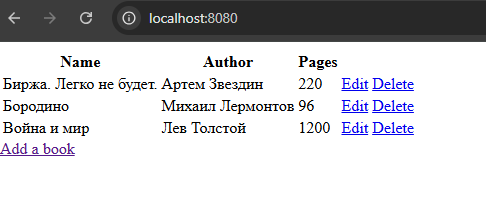

# $${\color{#ff0048}CRUD \space \color{#00f0ec}project \space \color{Magenta}for \space \color{yellow}data \space \color{pink}manipulation}$$

## Описание 
:rocket: Этот проект представляет собой простое веб-приложение, созданное с помощью Spring Boot, которое демонстрирует операции CRUD (создание, чтение, обновление, удаление) для управления списком книг.
 
:rocket: **Read:** Отобразить список всех книг.
 
:rocket:  **Create:** Добавить в список новую книгу.
 
:rocket: **Update:** Изменение существующей информации о книге.
 
:rocket: **Delete:** Удалить книгу из списка.
## Использованные технологии
:white_check_mark:   JAVA
:white_check_mark:   Spring Boot
:white_check_mark:   HTML
:white_check_mark:   UUID
## Установка 
**Склонируйте репозиторий и запустите проект в редакторе кода (IntelliJ IDEA). Далее в браузерной строке проект будет доступен по адресу:** $${\color{#00f0ec}localhost:8080}$$
 
:black_square_button: :black_square_button: :black_square_button:

